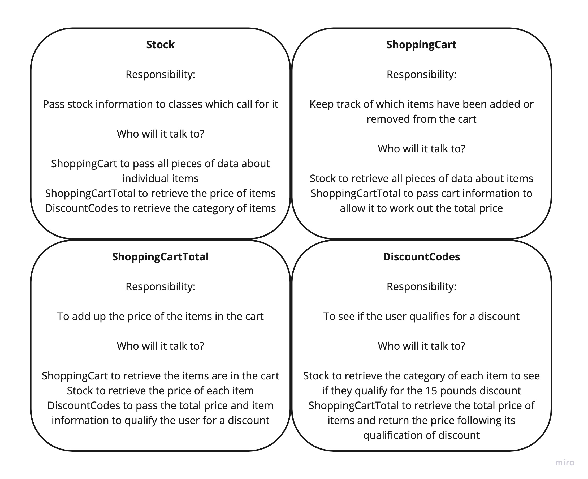
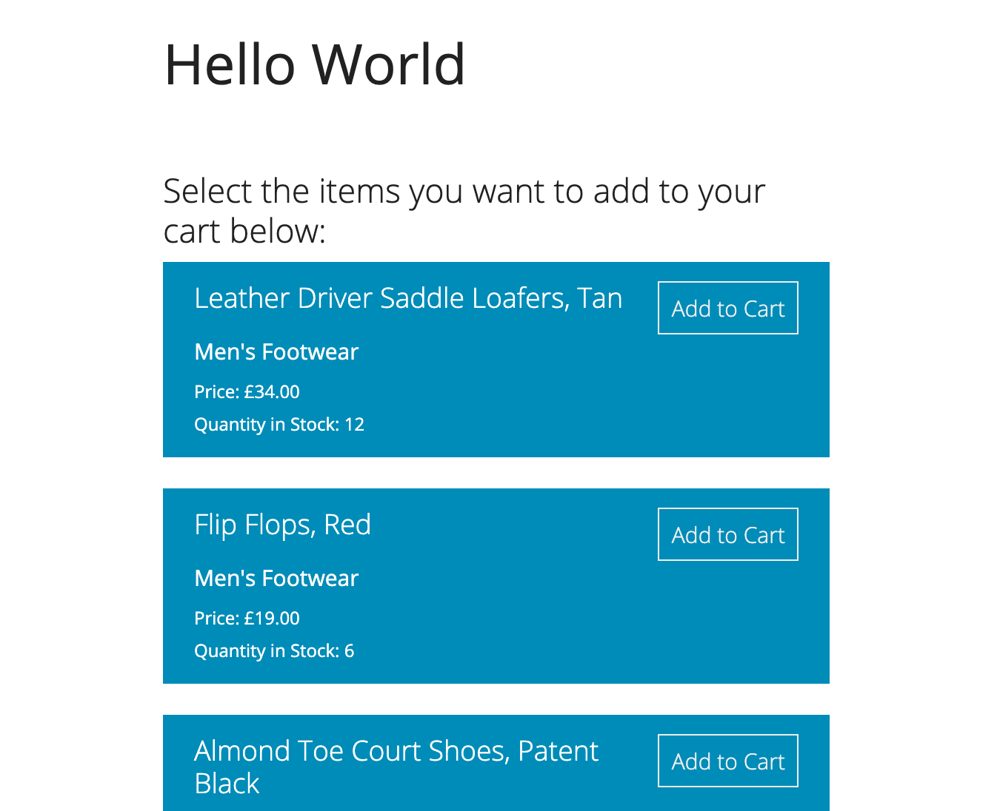
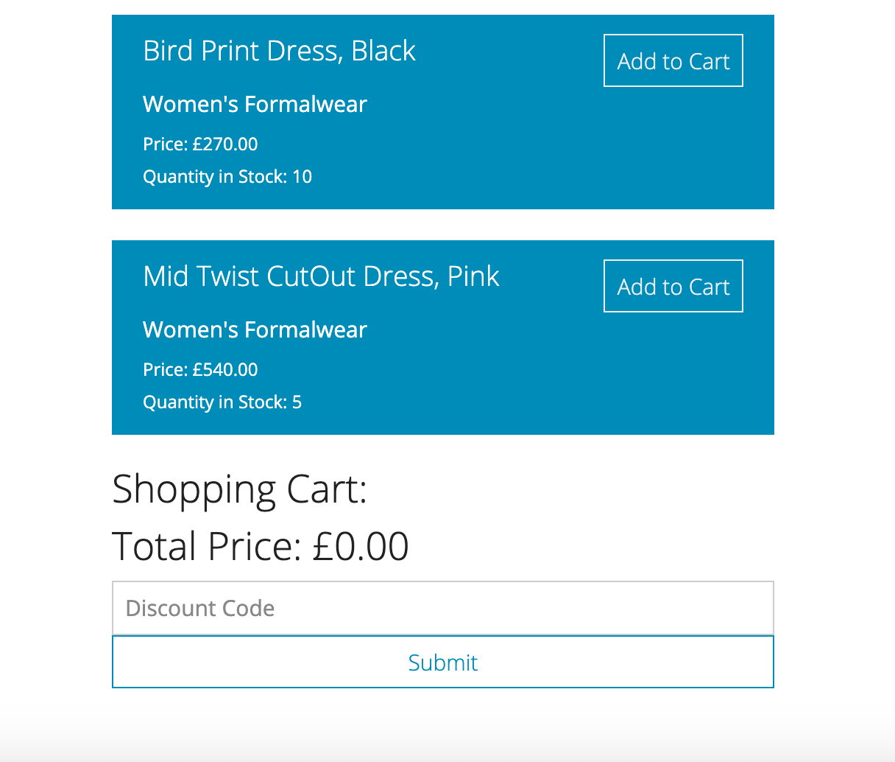
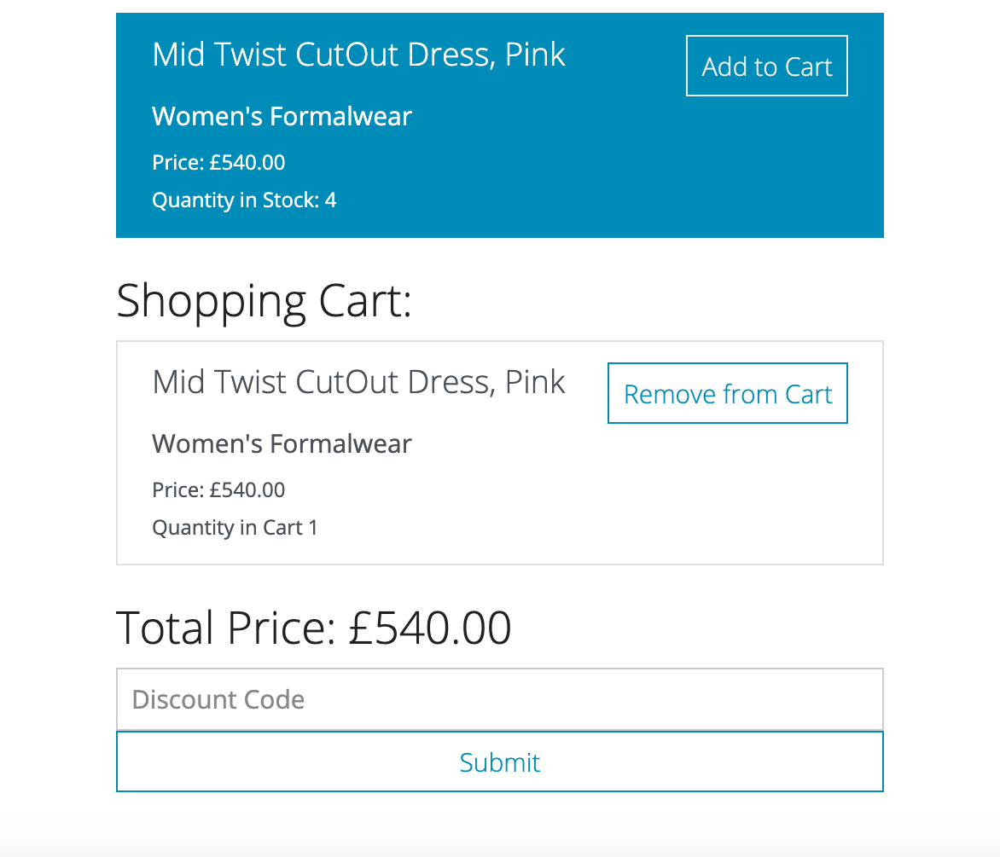
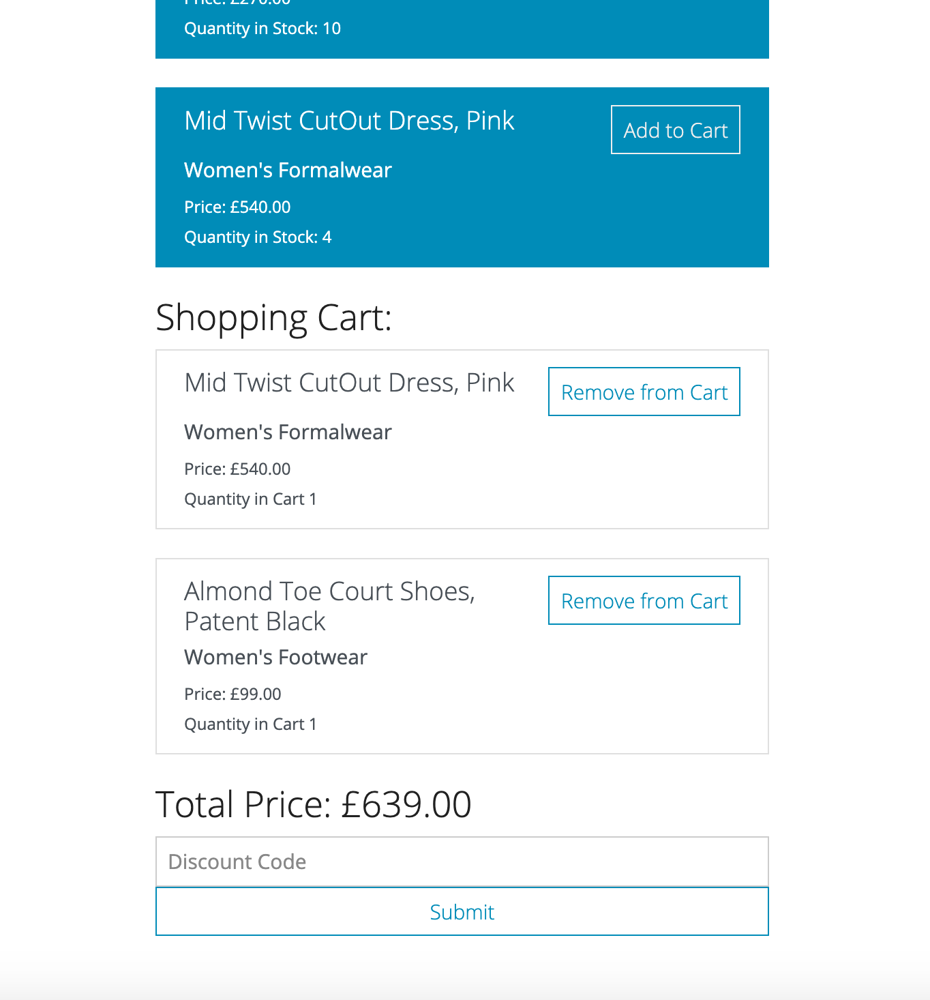
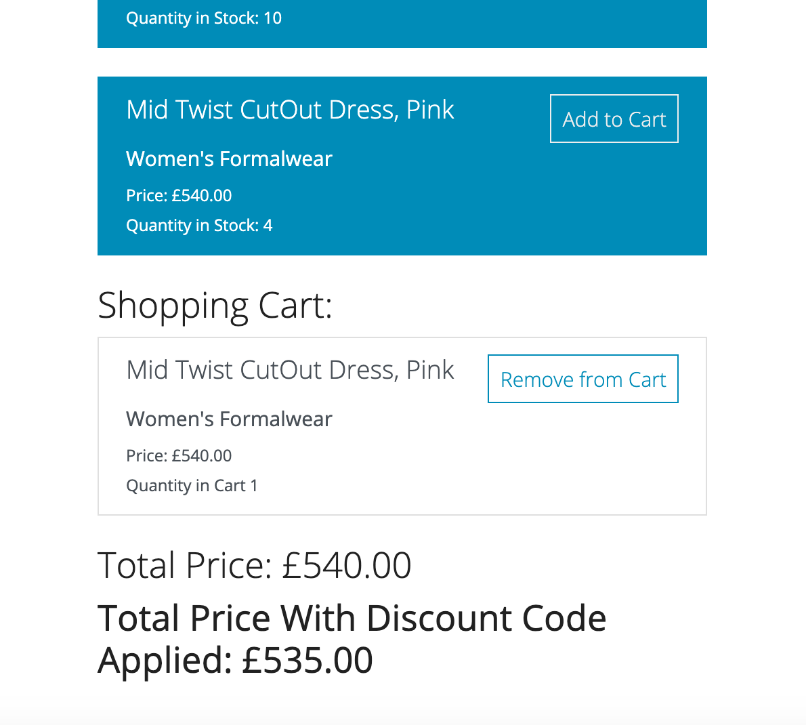

# Tech test

In this project, I was tasked with developing a responsive website for a clothing retailer. With no name given for the retailer, I chose the very inventive name of: 'Hello World'.

### Requirements

* The page that you develop should display all of the available products, as well as a shopping cart to which they can be added
* There are discount vouchers available that can be applied:
  * 5 pounds - no conditions - code: '5poundsoff'
  * 10 pounds - over 50 pounds in cart - code: '10poundsoff'
  * 15 pounds - over 75 pounds in cart and a footwear item - code: '15poundsoff'
* The data is given to you rather than using a database:

| Product Name | Category | Price | Quantity in Stock |
|--------------|----------|-------|-------------------|
| Almond Toe Court Shoes, Patent Black | Women’s Footwear | £99.00 | 5 |
|Suede Shoes, Blue | Women’s Footwear | £42.00 | 4 |
| Leather Driver Saddle Loafers, Tan | Men’s Footwear | £34.00 | 12 |
| Flip Flops, Red | Men’s Footwear | £19.00 | 6 |
| Flip Flops, Blue | Men’s Footwear | £19.00 | 0 |
| Gold Button Cardigan, Black | Women’s Casualwear | £167.00 | 6 |
| Cotton Shorts, Medium Red | Women’s Casualwear | £30.00 | 5 |
| Fine Stripe Short Sleeve Shirt, Grey | Men’s Casualwear | £49.99 | 9 |
| Fine Stripe Short Sleeve Shirt, Green | Men’s Casualwear | ~~£49.99~~ £39.99 | 3 |
| Sharkskin Waistcoat, Charcoal | Men’s Formalwear | £75.00 | 2 |
| Lightweight Patch Pocket Blazer, Deer | Men’s Formalwear | £175.50 | 1 |
| Bird Print Dress, Black | Women’s Formalwear | £270.00 | 10 |
| Mid Twist Cut­Out Dress, Pink | Women’s Formalwear | £540.00 | 5 |

#### User stories

```
As a User,
So I can save a product,
I want to be able to add a product to my shopping cart.
```

```
As a User,
So I can change my mind about a product,
I want to be able to remove a product from my shopping cart.
```

```
As a User,
So I can see how much is in my cart,
I want to be able to view the total price for the products in my shopping cart.
```

```
As a User,
So I can take advantage of offers,
I want to be able to apply a voucher to my shopping cart.
```

```
As a User,
So I can see how much I have saved,
I want to be able to view the total price for the products in my shopping cart with discounts applied.
```

```
As a User,
So I am sure my voucher has been applied,
I want to be alerted when I apply an invalid voucher to my shopping cart.
```

```
As a User,
So I am not let down last minute,
I want to be unable to add out of stock products to my shopping cart.
```


#### Approach and structure of my code

For this project, I took the approach that I was a consultant and the requirements given were to be met and **not** exceeded without client approval. Therefore, I stuck to these strictly and have added a section further down about what I would suggest to the client.

I aimed to write code following the single responsibility principle and encapsulation. I used a TDD/BDD procedure to drive my code and decided to use 4 classes with dependency injection to allow them to talk to one another.

I input the data into the Stock class as a default value. Due to not having access to the database directly, I wanted a way in which the information could be changed and thus not be hardcoded. I decided that the simplest way to pull the information would be through an array of arrays. However, I opted for an array of hashes. This was due to the want for the code to be more readable. For example, product[:name] allows you to know exactly which piece of information I am looking for unlike that of product[0]. In addition to this, if the inputted data was written in a different order, my code would still pick up the correct value.

This Stock class' purpose is simply to read the data and pass it to the class which calls upon it. The program is run through the ShoppingCart class. This performs the responsibility of monitoring what is in the shopping cart. The ShoppingCartTotal class calculates the total price with and without a discount. It completes the former task by passing the responsibility of calculating the discount to the DiscountCodes class. This one takes the information of the code, items, and total price to work out which, if any, discount the user qualifies for.

On completion, I decided to add a FormatPrice class. The method translating the float into a string was needed in more than one class - justifying the creation of a class itself.

#### Wireframes of class responsibility



#### Assumptions made from the requirements

- The final product should all be on one page
- It is important the website is responsive
- When an item is not available, it no longer appears in the list of stock on the website
- The strike out of one of the prices means the data needs to be changeable. Hence the default value of the stock
- The ability to purchase would be the next phase as it was not asked for
- No reference to multiple users, so there is no sign up, sign in, sign out. Therefore, the website is for one user at this moment.

#### Suggestions for the client

- A filtering system by category of clothing. This would make the page look nicer as well as be  more functional for the user. It would then be easy to add further filters such as price
- Have more than one page, this means the shopping cart could be on its own page and have a nav bar at the top pulling the website together as a whole
- Supply a logo to use, this would allow us to stamp your brand identity on the website
- Create a user sign up, sign in, sign out functionality
- The alert referred to checking the voucher is valid, it should also check the shopping cart qualifies for the voucher

#### Screenshots of the final product
##### Stock list


##### Shopping cart empty


##### Shopping cart one item


##### Shopping cart two items


##### Shopping cart discount applied


##### Invalid code alert


#### Run the program

To run this you need to:

- Clone the repo
- Enter the local repo file
- Check you have Ruby 2.6.0 installed
- Bundle install
- Run 'rackup' in your terminal
- Run 'localhost:9292' in the browser (check the port number - it will say in the terminal after you run 'rackup'

#### Testing

To test this app you need to:

- Clone the repo
- Enter the local repo file
- Check you have Ruby 2.6.0 installed
- Bundle install
- Run 'rspec' in the terminal to run tests with coverage

Outcome of the testing:
- 100% coverage
